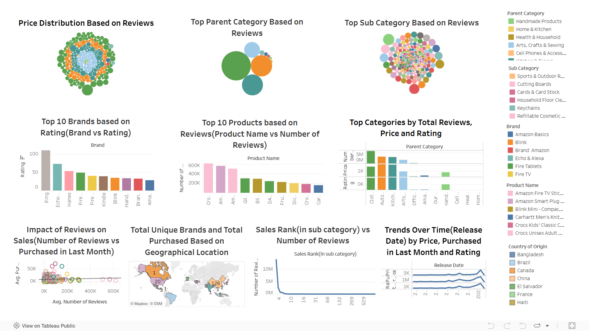

# Amazon Best Sellers Data Analysis

## 📊 Project Overview
This project analyzes product trends from Amazon's Best Sellers ([amazon.com/Best-Sellers](https://www.amazon.com/Best-Sellers/zgbs/)) to identify sales patterns, top-performing categories/brands, and customer preferences. The analysis reveals actionable insights for sellers, marketers, and e-commerce professionals.

**Total Data Scraped:** `600 rows × 14 columns`<br/>
**After Handling Missing Values:** `597 rows × 14 columns`

---

## 🖼️ Interactive Dashboard Preview
<br/>
<a href="https://public.tableau.com/app/profile/mominur.rahman/viz/AmazonBestSellersDataAnalysis/Dashboard" target="_blank">
  
</a><br/><br/>

**[Explore Full Dashboard on Tableau Public](https://public.tableau.com/app/profile/mominur.rahman/viz/AmazonBestSellersDataAnalysis/Dashboard)**

---

## 🔑 Key Findings

### 1. **Impact of Reviews on Sales**  
   - As the number of reviews increases, the sales of a product tend to increase significantly.

### 2. **Relationship Between Reviews and Seller Rank**  
   - Products with the highest number of reviews tend to rank closer to #1 in the seller rankings.

### 3. **Top Categories**  
   - **Parent Category:** *Clothing, Shoes & Jewelry*  
   - **Subcategory:** *Men's Mules & Clogs*  
     (Products in these categories with more reviews are purchased more frequently.)

### 4. **Top 10 Brands**  
   - The top brand is **Ring**, followed by others identified in the analysis.

### 5. **Top 10 Products**  
   - The leading product is **Crocs Unisex Adult Classic Clog**.

### 6. **Trends Over Time**  
   - Products released earlier (e.g., 2004) show lower sales in recent months, while newer products (e.g., 2024 releases) demonstrate higher sales growth.  
   - Based on this trend, products released in 2025 are expected to achieve the highest sales.

### 7. **Geographical Insights**  
   - A geographical analysis highlights the number of distinct brands across countries.  
   - For instance, China has 126 distinct brands, the highest among all countries.

---

## ⚙️ Technical Implementation

### Data Collection
- Scraped 600 products using Python (BeautifulSoup/Selenium)
- Raw dataset: `600 rows × 14 columns`
- Cleaned dataset: `597 rows × 14 columns` ([Data Preparation Notebook](data_preparation.ipynb))

### Tools Used

- **Python > pandas, selenium, BeautifulSoup**
- **Tableau**
- **Jupyter Notebook**

---

## 🚀 Project Usage Guide

To replicate or extend this analysis, follow the steps below:

### Prerequisites
Ensure Python is installed on your machine.

### Steps to Run the Project

1. **Clone the Repository**  
   ```bash
   git clone https://github.com/mominurr/Trending-Products-on-E-Commerce-Website.git
    ```
2. **Create a Virtual Environment**

    ```bash
    python -m venv myvenv
    ```
3. **Install Dependencies**

    ```
    pip install -r requirements.txt
    ```
4. **Run the Scraper Script**

    Execute the script to scrape data from Amazon.
    ```bash
    python scraper.py
    ```
- The scraped data will be saved as ``data/raw_data.csv``.

### **Process the Data**

Open and run the `data_preparation.ipynb` notebook to handle missing and duplicate values.

- The cleaned data will be saved as ``data/cleaned_data.csv``.

## 📜 License
This project is licensed under the **MIT License** – see the [LICENSE](LICENSE) file for details.

## 🛠️ Contributions
We welcome contributions! Feel free to fork the repository and submit a pull request.

## 📩 Contact
For any inquiries or collaborations:
- **Portfolio:** [mominur.dev](https://mominur.dev)
- **GitHub:** [github.com/mominurr](https://github.com/mominurr)
- **LinkedIn:** [linkedin.com/in/mominur--rahman](https://www.linkedin.com/in/mominur--rahman/)
- **Email:** mominurr518@gmail.com

🚀 **Star this repo** ⭐ if you find it useful!
